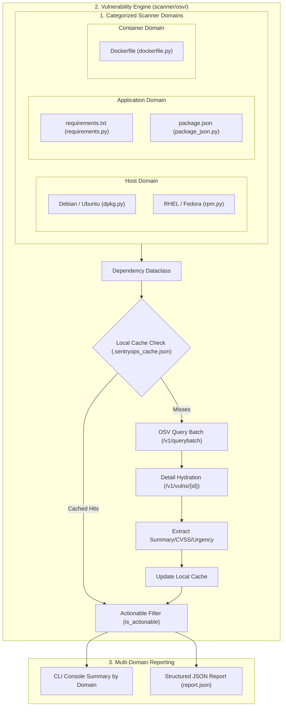

# SentryOps — Infrastructure Vulnerability Scanner Documentation

## 1. Executive Summary

**SentryOps** is a modular DevSecOps tool written in Python. It categorizes infrastructure vulnerability auditing across three target domains:
* **Host**: Linux system packages (`dpkg` for Debian/Ubuntu, `rpm` for RHEL/CentOS/Fedora).
* **Application**: Application dependency manifests (`requirements.txt` for Python/PyPI, `package.json` for Node.js/npm).
* **Container**: Container base images (`Dockerfile`).

Findings are cross-referenced against the **OSV.dev API**, hydrated with CVSS severity vectors, filtered to exclude historical noise (`Debian Urgency: unimportant`), and exported to `report.json`.

---

## 2. Target Domain & Package Architecture

```text
SentryOps
│
├── Host (scanner/host/)
│   ├── dpkg.py          --> Scans Debian/Ubuntu system packages (dpkg-query)
│   ├── rpm.py           --> Scans RHEL/Fedora/CentOS system packages (rpm -qa)
│   └── detector.py      --> Distro detector (/etc/os-release) & host scanner
│
├── Application (scanner/application/)
│   ├── requirements.py  --> Parses Python PyPI dependencies (requirements.txt)
│   └── package_json.py  --> Parses Node.js npm dependencies (package.json)
│
└── Container (scanner/container/)
    └── dockerfile.py    --> Parses Container base images (Dockerfile)
```

---

## 3. System Architecture & Flow



---

## 4. Core Data Model

All domain scanners normalize package discoveries into the `Dependency` dataclass defined in [`scanner/models.py`](file:///home/takaya/Desktop/SentryOps/scanner/models.py):

```python
@dataclass(slots=True)
class Dependency:
    name: str
    version: str | None
    ecosystem: str
```

### Domain & Ecosystem Mapping

| Domain Category | Scanner Module | Ecosystem String | Package Target Source |
| :--- | :--- | :--- | :--- |
| **Host** | [`scanner/host/dpkg.py`](file:///home/takaya/Desktop/SentryOps/scanner/host/dpkg.py) | `Debian:<ver>` / `Ubuntu:<ver>` | System packages via `dpkg-query` |
| **Host** | [`scanner/host/rpm.py`](file:///home/takaya/Desktop/SentryOps/scanner/host/rpm.py) | `RHEL:<ver>` / `Fedora:<ver>` | System packages via `rpm -qa` |
| **Application** | [`scanner/application/requirements.py`](file:///home/takaya/Desktop/SentryOps/scanner/application/requirements.py) | `PyPI` | Python packages in `requirements.txt` |
| **Application** | [`scanner/application/package_json.py`](file:///home/takaya/Desktop/SentryOps/scanner/application/package_json.py) | `npm` | Node.js dependencies in `package.json` |
| **Container** | [`scanner/container/dockerfile.py`](file:///home/takaya/Desktop/SentryOps/scanner/container/dockerfile.py) | `docker` | Base images in `Dockerfile` |

---

## 5. Vulnerability Engine & OSV Integration ([scanner/osv/client.py](file:///home/takaya/Desktop/SentryOps/scanner/osv/client.py))

### Key Subsystems

1. **OSV Ecosystem Mapping (`get_osv_ecosystem`)**:
   * Maps detected host distro info (`os_id`, `version`) to OSV versioned ecosystems (e.g. `Debian:13` or `Ubuntu:22.04`).

2. **Debian Version Normalization (`normalize_debian_version`)**:
   * Strips backport/build suffixes (`25.01+dfsg-1~deb13u2` -> `25.01`) for consistent version representation.

3. **Batched API Processing (`check_dependencies`)**:
   * Utilizes `https://api.osv.dev/v1/querybatch` to query up to 1,000 packages per HTTP request, preventing rate-limiting issues across large package sets.

4. **Detail Hydration (`parse_vuln_details`)**:
   * Fetches `/v1/vulns/{id}` for hits to extract:
     * **Summary**: Reads `v["summary"]` or falls back to `v["details"]`.
     * **Severity**: Reads top-level `CVSS_V3`/`CVSS_V4` vectors, falling back to `database_specific.severity` and `ecosystem_specific.urgency`.

5. **Actionable Vulnerability Filtering (`is_actionable`)**:
   * Filters out historical/disputed `Debian Urgency: unimportant` records. Only CVSS-scored entries are flagged as actionable.

6. **Local Disk Caching**:
   * Saves responses to [.sentryops_cache.json](file:///home/takaya/Desktop/SentryOps/.sentryops_cache.json) under `{ecosystem}:{name}=={version}`.

---

## 6. Output & Report Specification

Running [`scanner/main.py`](file:///home/takaya/Desktop/SentryOps/scanner/main.py) scans all three domains and produces [report.json](file:///home/takaya/Desktop/SentryOps/report.json):

```json
{
  "timestamp": "2026-08-11T11:07:16.096062+00:00",
  "host": {
    "os_name": "Debian GNU/Linux",
    "os_id": "debian",
    "version": "13",
    "architecture": "x86_64"
  },
  "summary": {
    "total_packages_scanned": 1898,
    "packages_scanned_by_category": {
      "host": 1897,
      "application": 1,
      "container": 0
    },
    "total_actionable_cves": 333
  },
  "findings": {
    "host": {
      "7zip==25.01+dfsg-1~deb13u2": [
        {
          "id": "DEBIAN-CVE-2022-47111",
          "summary": "7-Zip 22.01 does not report an error for certain invalid xz files...",
          "severity": "CVSS_V3: CVSS:3.1/AV:L/AC:L/PR:N/UI:R/S:U/C:N/I:L/A:N"
        }
      ]
    },
    "application": {},
    "container": {}
  }
}
```

---

## 7. Execution Guide

```bash
# Execute multi-domain vulnerability scan across Host, Application, and Container
python3 scanner/main.py
```
