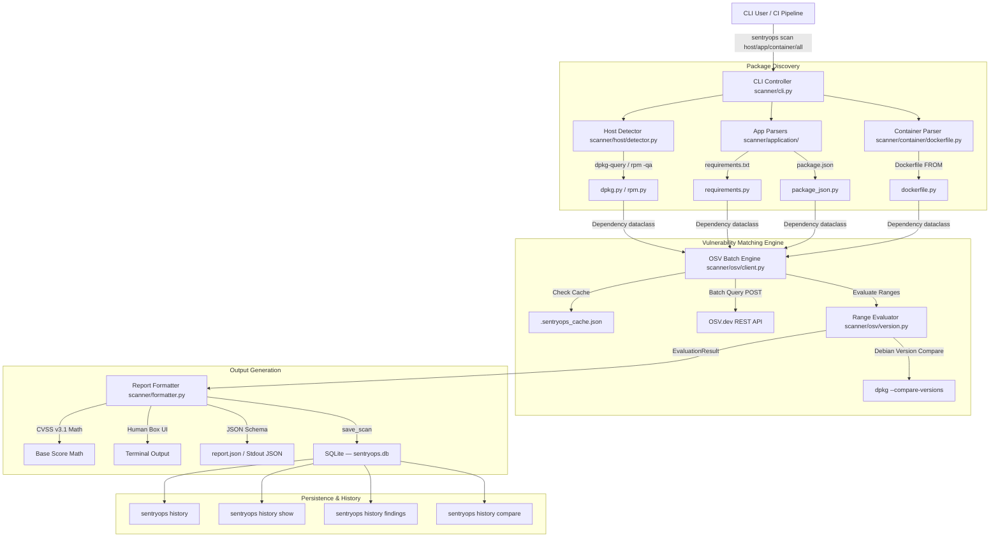
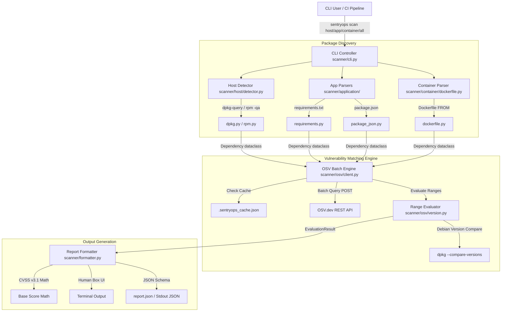

# SentryOps — Complete System Documentation & Technical Reference

This is the comprehensive, exhaustive technical reference for **SentryOps** — a modular, multi-domain infrastructure security scanner built in Python.

This document explains **every module, class, function, algorithm, data schema, CVSS math formula, CLI command, and design decision** across the SentryOps codebase so you can answer any architectural or operational question with total mastery.

---

## 📋 Table of Contents
1. [Project Overview & Architecture](#1-project-overview--architecture)
2. [Project Directory & File Map](#2-project-directory--file-map)
3. [Core Data Model (`scanner/models.py`)](#3-core-data-model-scannermodelspy)
4. [Package Discovery Domain Modules](#4-package-discovery-domain-modules)
   - [Host OS Scanner (`scanner/host/`)](#host-os-scanner-scannerhost)
   - [Application Manifest Scanner (`scanner/application/`)](#application-manifest-scanner-scannerapplication)
   - [Container Base Image Scanner (`scanner/container/`)](#container-base-image-scanner-scannercontainer)
5. [Vulnerability Engine & Matching Core (`scanner/osv/`)](#5-vulnerability-engine--matching-core-scannerosv)
   - [Ecosystem & Version Matching (`scanner/osv/version.py`)](#ecosystem--version-matching-scannerosvversionpy)
   - [OSV API Client & Cache System (`scanner/osv/client.py`)](#osv-api-client--cache-system-scannerosvclientpy)
6. [Scoring & Output Formatter (`scanner/formatter.py`)](#6-scoring--output-formatter-scannerformatterpy)
   - [CVSS v3.1 Mathematical Scoring Formula](#cvss-v31-mathematical-scoring-formula)
   - [Human-Readable Terminal & JSON Report Renderers](#human-readable-terminal--json-report-renderers)
7. [CLI Controller (`scanner/cli.py`) & Commands](#7-cli-controller-scannerclipy--commands)
8. [SQLite Persistence Layer (`scanner/db/`)](#8-sqlite-persistence-layer-scannerdb)
   - [Schema & Tables (`schema.py`)](#schema--tables-schemapy)
   - [Store Operations (`store.py`)](#store-operations-storepy)
   - [Finding Identity & Cross-Scan Comparison](#finding-identity--cross-scan-comparison)
9. [Automated Regression Test Suite (`tests/test_engine.py`)](#9-automated-regression-test-suite-teststest_enginepy)
10. [Interview & Audit Cheat-Sheet](#10-interview--audit-cheat-sheet)

---

## 1. Project Overview & Architecture

SentryOps scans software assets across **3 target domains** (Host OS, Application Manifests, Container Images), normalizes discovered items into a unified `Dependency` representation, queries the **OSV.dev REST API** in high-throughput 1,000-package batches, evaluates vulnerability ranges using **ecosystem-scoped semantics** and system `dpkg --compare-versions`, persists all results to a **local SQLite database**, and generates structured reports and historical comparisons.

### Visual Architecture Diagram



### Visual Architecture Diagram



---

## 2. Project Directory & File Map

| Path | Purpose / Description |
| :--- | :--- |
| **`sentryops`** | Shell entrypoint script pointing to `scanner.cli:main()`. |
| **`setup.py`** | Package setup script installing `sentryops` as a global CLI command. |
| **`sentryops.db`** | SQLite database file auto-created on first scan. Stores all scan, package, and finding records permanently. |
| **`scanner/`** | Main package root directory containing all submodules. |
| ├── **`models.py`** | Core `Dependency` dataclass schema. |
| ├── **`cli.py`** | Argparse CLI entrypoint, command routing, timing logic, and ANSI-coloured history renderers. |
| ├── **`formatter.py`** | FIRST.org CVSS v3.1 mathematical score calculator and report renderers. |
| ├── **`host/`** | Host OS discovery package. |
| │   ├── **`detector.py`** | OS identification via `/etc/os-release` and host scanning coordinator. |
| │   ├── **`dpkg.py`** | Scans Debian/Ubuntu system packages via `dpkg-query`. |
| │   └── **`rpm.py`** | Scans RHEL/CentOS/Fedora system packages via `rpm -qa`. |
| ├── **`application/`** | Application dependency parsing package. |
| │   ├── **`requirements.py`** | Python `requirements.txt` parser. |
| │   └── **`package_json.py`** | Node.js `package.json` parser. |
| ├── **`container/`** | Container base image parsing package. |
| │   └── **`dockerfile.py`** | Dockerfile `FROM` directive parser. |
| ├── **`osv/`** | Vulnerability query & version evaluation engine. |
| │   ├── **`version.py`** | `dpkg --compare-versions` wrapper, event range parser, `EvaluationResult`. |
| │   └── **`client.py`** | OSV REST API batch client, local cache manager (`.sentryops_cache.json`). |
| └── **`db/`** | SQLite persistence package. |
|     ├── **`__init__.py`** | Re-exports all public DB functions as the `scanner.db` package API. |
|     ├── **`schema.py`** | `CREATE TABLE` DDL, index definitions, `get_connection()`, `init_db()`, `generate_scan_id()`. |
|     └── **`store.py`** | Row-level write (`save_scan`) and read (`list_scans`, `get_scan`, `get_findings_for_package`, `compare_scans`) operations. |
| **`tests/`** | Automated test suite. |
| └── **`test_engine.py`** | 10-case automated regression test suite (`unittest`). |

---

## 3. Core Data Model (`scanner/models.py`)

All discovery modules normalize scanned software packages into the `Dependency` dataclass:

```python
from dataclasses import dataclass

@dataclass(slots=True)
class Dependency:
    name: str          # e.g., "openssl", "requests", "ubuntu"
    version: str | None # e.g., "3.0.13-1", "2.31.0", "22.04"
    ecosystem: str     # e.g., "dpkg", "rpm", "PyPI", "npm", "docker"
    source: str        # e.g., "dpkg", "requirements.txt", "package.json", "Dockerfile"
    location: str      # e.g., "host", "./requirements.txt", "./Dockerfile"
```

### Why dataclass with `slots=True`?
Using `slots=True` eliminates `__dict__` memory overhead for every package object, speeding up scanning across large package inventories (1,800+ system packages) while reducing memory consumption.

---

## 4. Package Discovery Domain Modules

### Host OS Scanner (`scanner/host/`)

#### 1. `scanner/host/detector.py`
- **`HostInfo` Dataclass**: Stores `os_name`, `os_id` (e.g. `"debian"`), `version` (e.g. `"13"`), `architecture`.
- **`detect_host_os() -> HostInfo | None`**:
  Reads `/etc/os-release` line-by-line to parse `ID=`, `VERSION_ID=`, and `PRETTY_NAME=`. Returns a populated `HostInfo` object.
- **`scan_host_packages(host_info) -> list[Dependency]`**:
  Determines system package manager:
  - If `host_info.os_id` is in `("debian", "ubuntu", "mint", "kali", "pop")`, calls `scanner.host.dpkg.scan_dpkg_packages()`.
  - Else calls `scanner.host.rpm.scan_rpm_packages()`.

#### 2. `scanner/host/dpkg.py`
- **`scan_dpkg_packages() -> list[Dependency]`**:
  Runs command: `dpkg-query -W -f='${Package}\t${Version}\n'`.
  Splits output line by line on `\t` into `(pkg_name, pkg_version)`.
  Returns `Dependency(name=pkg_name, version=pkg_version, ecosystem="dpkg", source="dpkg", location="host")`.

#### 3. `scanner/host/rpm.py`
- **`scan_rpm_packages() -> list[Dependency]`**:
  Runs command: `rpm -qa --qf '%{NAME}\t%{VERSION}-%{RELEASE}\n'`.
  Splits output line by line on `\t` into `(pkg_name, pkg_version)`.
  Returns `Dependency(name=pkg_name, version=pkg_version, ecosystem="rpm", source="rpm", location="host")`.

---

### Application Manifest Scanner (`scanner/application/`)

#### 1. `scanner/application/requirements.py`
- **`parse_requirements_txt(filepath="requirements.txt") -> list[Dependency]`**:
  Reads lines from `requirements.txt`. Ignores comments (`#`) and options (`-r`, `-e`).
  Splits package specifiers on `==`, `>=`, `<=`, `~=`.
  Extracts pinned version (e.g. `requests==2.31.0`).
  Returns `Dependency(name="requests", version="2.31.0", ecosystem="PyPI", source="requirements.txt", location=filepath)`.

#### 2. `scanner/application/package_json.py`
- **`parse_package_json(filepath="package.json") -> list[Dependency]`**:
  Parses `package.json` JSON file. Reads `"dependencies"` and `"devDependencies"` dictionaries.
  Strips semver range prefixes (`^`, `~`, `>=`, `v`).
  Returns `Dependency(name=pkg, version=clean_ver, ecosystem="npm", source="package.json", location=filepath)`.

---

### Container Base Image Scanner (`scanner/container/`)

#### 1. `scanner/container/dockerfile.py`
- **`parse_dockerfile(filepath="Dockerfile") -> list[Dependency]`**:
  Reads `Dockerfile`. Scans for lines starting with `FROM`.
  Parses image name and tag (e.g. `FROM ubuntu:22.04` -> `name="ubuntu"`, `version="22.04"`).
  Returns `Dependency(name=img, version=tag, ecosystem="docker", source="Dockerfile", location=filepath)`.

---

## 5. Vulnerability Engine & Matching Core (`scanner/osv/`)

### Ecosystem & Version Matching (`scanner/osv/version.py`)

This module is the core intelligence of SentryOps. It implements **release-isolated matching**, **package-name scoping**, **priority fixed-range evaluation**, and **system Debian version comparison**.

#### 1. Dataclasses & Data Types
- **`EvaluationResult` Dataclass**:
  ```python
  @dataclass(slots=True)
  class EvaluationResult:
      is_affected: bool
      ecosystem: str            # e.g., "Debian:13"
      package_name: str         # e.g., "jq"
      installed_version: str    # e.g., "1.7.1-6+deb13u2"
      range: dict[str, str|None] # {"introduced": "0", "fixed": "1.7.1-6+deb13u3"}
      comparator: str           # "dpkg" or "semver"
  ```
  - **`to_match_dict()` Method**: Returns structured dictionary representation formatted for JSON reports.

#### 2. Debian Version Comparison (`compare_debian_versions`)
```python
def compare_debian_versions(v1: str, op: str, v2: str) -> bool:
    res = subprocess.run(["dpkg", "--compare-versions", v1, op, v2], ...)
    return res.returncode == 0
```
- **Why `dpkg --compare-versions`?**
  Debian package versions use epochs (`2:`), revisions (`-7`), and backport tags (`~deb13u2`). Standard semver libraries or string comparisons fail (e.g., string comparison says `"25.01" < "22.01"` is False, whereas Debian comparison handles epoch/backport rules).

#### 3. Range Parsing (`_parse_event_ranges`)
Converts raw OSV event arrays into `(introduced, fixed, last_affected)` pairs:
- Handles paired events: `[{introduced: "0"}, {fixed: "1.2.3"}]`.
- Handles open-ended ranges: `[{introduced: "0"}]`.
- Handles `last_affected` events: `[{introduced: "0"}, {last_affected: "1.2.2"}]`.

#### 4. Vulnerability Range Evaluator (`evaluate_affected_range`)
```python
def evaluate_affected_range(
    installed_ver: str,
    affected_list: list[dict],
    target_ecosystem: str,
    package_name: str = ""
) -> EvaluationResult | None
```
**Evaluation Algorithm**:
1. **Strict Filtering**: Inspects only `affected` entries where `package.ecosystem == target_ecosystem` AND `package.name == package_name`. Discards advisories from other releases (`Debian:11`, `Debian:12`) and other packages.
2. **Unimportant Urgency Filter**: Ignores entries marked `ecosystem_specific.urgency == "unimportant"` by Debian Security Tracker.
3. **Priority 1 (Fixed Ranges)**:
   - Gathers all ranges defining a `fixed` version `F`.
   - If `installed_ver < F` (evaluated via `dpkg --compare-versions`), returns `EvaluationResult(is_affected=True, range={"introduced": intro, "fixed": F})`.
   - If `installed_ver >= F` for all fixed ranges, marks package as **patched** and returns `None`.
4. **Priority 2 (Open-Ended Ranges)**:
   - If no fixed versions exist across the package's advisories in `target_ecosystem`, evaluates open ranges `[introduced, ∞)` or `[introduced, last_affected]`.

---

### OSV API Client & Cache System (`scanner/osv/client.py`)

#### 1. `get_osv_ecosystem(os_id, version) -> str`
Maps host OS distro ID and version number to official OSV ecosystem string:
- `debian` + `13` -> `"Debian:13"`
- `ubuntu` + `22.04` -> `"Ubuntu:22.04"`
- `rhel` + `9` -> `"Red Hat"`

#### 2. `parse_vuln_details(v, target_ecosystem, installed_ver, package_name) -> dict | None`
Parses raw vulnerability JSON from OSV API:
- Invokes `evaluate_affected_range(installed_ver, v["affected"], target_ecosystem, package_name)`.
- If `eval_result` is `None` (package patched or not affected), returns `None` (discarded).
- If affected, extracts `summary`, CVSS severity strings, sets `"status": "affected"`, `"fixed": fixed_ver or "None"`, and builds structured `"match"` dictionary.

#### 3. `check_dependencies(dependencies, os_id, os_version) -> dict[str, list[dict]]`
High-throughput batch vulnerability query coordinator:
- Checks local disk cache (`.sentryops_cache.json`) under key `{ecosystem}:{name}=={version}`.
- Batches un-cached packages into **1,000-package HTTP POST queries** to `https://api.osv.dev/v1/querybatch`.
- For hits, fetches detailed vulnerability info from `https://api.osv.dev/v1/vulns/{id}`.
- Saves raw responses to `.sentryops_cache.json` for sub-second repeat scans.

---

## 6. Scoring & Output Formatter (`scanner/formatter.py`)

### CVSS v3.1 Mathematical Scoring Formula

SentryOps implements the official **FIRST.org CVSS v3.1 Base Score equation** in `calculate_cvss_score(severity_str)`:

$$\text{CVSS Base Score} = \min(\text{Impact} + \text{Exploitability}, 10.0)$$

#### Sub-equations:
1. **ISS (Impact Sub-Score)**:
   $$\text{ISS} = 1 - (1 - C) \times (1 - I) \times (1 - A)$$
   Where $C, I, A$ are metric values for Confidentiality, Integrity, and Availability (`None=0.0`, `Low=0.22`, `High=0.56`).

2. **Impact**:
   - If Scope is Unchanged (`S:U`):
     $$\text{Impact} = 6.42 \times \text{ISS}$$
   - If Scope is Changed (`S:C`):
     $$\text{Impact} = 7.52 \times (\text{ISS} - 0.029) - 3.25 \times (\text{ISS} - 0.02)^{15}$$

3. **Exploitability**:
   $$\text{Exploitability} = 8.22 \times \text{AV} \times \text{AC} \times \text{PR} \times \text{UI}$$
   Where Attack Vector ($\text{AV}$), Attack Complexity ($\text{AC}$), Privileges Required ($\text{PR}$), and User Interaction ($\text{UI}$) are metric coefficients.

#### Severity Ranks:
- **`CRITICAL`**: Score $\ge 9.0$
- **`HIGH`**: Score $7.0 - 8.9$
- **`MEDIUM`**: Score $4.0 - 6.9$
- **`LOW`**: Score $< 4.0$

---

### Human-Readable Terminal & JSON Report Renderers

#### 1. `render_human_readable(scan_meta, summary, host_info, package_manager)`
Outputs terminal UI box layout displaying:
- Target name, type, OS name, package manager.
- Total packages scanned and vulnerability severity counts.
- Critical & High findings breakdown with `Package`, `Installed`, `Fixed`, `Severity`, `Ecosystem`, and `Match Reason`.
- Execution timing label with `(cached)` tag when loaded from cache.

#### 2. `render_json_report(scan_meta, summary)`
Outputs machine-readable JSON:

```json
{
  "scan": {
    "id": "scan-20260815-001",
    "started_at": "2026-08-15T15:51:46Z",
    "duration": 0.05,
    "target": "application",
    "type": "app",
    "scan_types": [
      "application"
    ]
  },
  "summary": {
    "packages": 1,
    "vulnerabilities": 3,
    "critical": 0,
    "high": 0,
    "medium": 3,
    "low": 0
  },
  "findings": [
    {
      "cve_id": "GHSA-9hjg-9r4m-mvj7",
      "package": "requests",
      "installed": "2.31.0",
      "fixed": "2.32.4",
      "severity": "MEDIUM",
      "status": "affected",
      "ecosystem": "PyPI",
      "match": {
        "ecosystem": "PyPI",
        "range": {
          "introduced": "0",
          "fixed": "2.32.4"
        },
        "installed_version": "2.31.0",
        "comparator": "semver",
        "result": "affected"
      },
      "match_reason": "Installed 2.31.0 < fixed 2.32.4 in PyPI"
    }
  ]
}
```

---

## 7. CLI Controller (`scanner/cli.py`) & Commands

### Scan Commands

| Command | Aliases | Target Domain Scanned | Description |
| :--- | :--- | :--- | :--- |
| **`sentryops scan host`** | `host` | **Linux OS Packages** | Scans system packages via `dpkg` (Debian/Ubuntu) or `rpm` (RHEL/Fedora/CentOS). |
| **`sentryops scan app`** | `dependencies`, `application` | **Application Dependencies** | Scans application manifests (`requirements.txt`, `package.json`). |
| **`sentryops scan container`** | `docker` | **Container Images** | Scans base images specified in `Dockerfile` manifests. |
| **`sentryops scan all`** | `all` *(Default)* | **All 3 Domains** | Unified multi-domain scan across Host, Application, and Container targets. |

### Scan Output Flags

| Flag | Example | Effect |
| :--- | :--- | :--- |
| `--output text` / `-o text` | `sentryops scan host -o text` | Default terminal box output. |
| `--output json` / `-o json` | `sentryops scan host -o json` | Structured JSON to stdout. |
| `--output <path>` / `-o report.json` | `sentryops scan host -o out.json` | Writes JSON to file AND prints human output. |
| `--format json` / `-f json` | `sentryops scan host -f json` | Explicit format override. |

> **Automatic Persistence**: Every scan, regardless of output flag, is saved to `sentryops.db` automatically via `save_scan()`. The terminal output always shows the scan ID so you can look it up later.

### History Commands

| Command | Example | Description |
| :--- | :--- | :--- |
| **`sentryops history`** | `sentryops history` | Tabular list of the 10 most recent scans with ANSI-coloured severity counts. |
| **`sentryops history --limit N`** | `sentryops history -n 25` | Show the last N scans. |
| **`sentryops history show <scan-id>`** | `sentryops history show scan-20260816-4352dd6b` | Full metadata block for one scan: OS, target, duration, status, severity bar chart, top packages by finding count. |
| **`sentryops history findings <scan-id>`** | `sentryops history findings scan-20260816-4352dd6b` | Every finding for a scan, grouped and sorted by severity (CRITICAL → LOW), with package name, CVE ID, installed version, and fixed version. |
| **`sentryops history findings <scan-id> --severity CRITICAL`** | `sentryops history findings <id> -s HIGH` | Same as above but filtered to a single severity level. |
| **`sentryops history compare <old-id> <new-id>`** | `sentryops history compare scan-A scan-B` | Side-by-side security posture diff: severity delta table, list of new vulnerabilities, list of resolved vulnerabilities, and count of unchanged findings. |

### `run_history_compare` — Example Output

```
Scan Comparison
────────────────────────────────────────────────────────────
  Previous     scan-20260815-abcd1234  (2026-08-15 14:22:01 UTC)
  Current      scan-20260816-4352dd6b  (2026-08-16 20:55:20 UTC)

Security Posture
────────────────────────────────────────────────────────────
  Severity       Before    After     Change
  CRITICAL           15        8         -7
  HIGH               72       61        -11
  MEDIUM             78       70         -8
  LOW                46       42         -4
  TOTAL             211      181        -30

  Unchanged: 181 findings carried over

New Vulnerabilities  (+0)
────────────────────────────────────────────────────────────
  No new vulnerabilities introduced.

Resolved Vulnerabilities  (-30)
────────────────────────────────────────────────────────────
  HIGH    curl      DEBIAN-CVE-2026-10536   no fix
  ...
```

---

## 8. SQLite Persistence Layer (`scanner/db/`)

Every scan run by SentryOps is **automatically persisted** to a local SQLite database file (`sentryops.db`) in the working directory. The `scanner/db/` package provides the full data layer: schema definition, row insertion, and structured query operations.

---

### Schema & Tables (`schema.py`)

The schema has **3 tables** connected by foreign keys. WAL (Write-Ahead Logging) mode is enabled for concurrent read safety.

#### `scans` table
One row per scan run.

| Column | Type | Description |
| :--- | :--- | :--- |
| `id` | `TEXT PK` | Unique scan ID: `scan-YYYYMMDD-<8-char-uuid>` (e.g. `scan-20260816-4352dd6b`). |
| `started_at` | `TEXT NOT NULL` | ISO 8601 UTC timestamp of when the scan started. |
| `duration` | `REAL` | Total scan duration in seconds (wall clock). |
| `target` | `TEXT NOT NULL` | Scan target name: `"localhost"`, `"application"`, `"container"`. |
| `target_type` | `TEXT NOT NULL` | Human label: `"Linux Host"`, `"Application Dependencies"`, `"Container Base Images"`. |
| `scan_types` | `TEXT` | JSON array of domains actually scanned: `["host", "application"]`. |
| `os` | `TEXT` | Detected OS string: `"Debian GNU/Linux 13"`. `NULL` for app-only scans. |
| `scanner_version` | `TEXT NOT NULL` | SentryOps version string at time of scan. |
| `status` | `TEXT` | Always `"completed"` for now; reserved for future `"failed"` / `"partial"` states. |

#### `packages` table
One row per **package observed in a scan**. The same package name can appear across many scans with different versions.

| Column | Type | Description |
| :--- | :--- | :--- |
| `id` | `INTEGER PK` | Auto-incremented row ID. **Never use this as a cross-scan identity key.** |
| `scan_id` | `TEXT FK → scans.id` | Parent scan. |
| `name` | `TEXT NOT NULL` | Package name: `"curl"`, `"requests"`. |
| `version` | `TEXT NOT NULL` | Installed version at time of scan: `"8.14.1-2+deb13u4"`. |
| `ecosystem` | `TEXT NOT NULL` | OSV ecosystem string: `"Debian:13"`, `"PyPI"`, `"npm"`. |
| `package_manager` | `TEXT NOT NULL` | Tool that manages this package: `"dpkg"`, `"pip"`, `"npm"`, `"docker"`. |
| `source_type` | `TEXT NOT NULL` | Where the package was discovered: `"dpkg"`, `"requirements.txt"`, `"package.json"`, `"Dockerfile"`. |

> **Design note**: Packages are **not globally deduplicated** across scans. Each scan gets its own set of package rows, because the same package can have a different version in scan A vs scan B. The package row represents *"this package was observed at this version during this specific scan"*.

#### `findings` table
One row per **(package × vulnerability)** pair. Each finding is linked to both its parent scan and parent package.

| Column | Type | Description |
| :--- | :--- | :--- |
| `id` | `INTEGER PK` | Auto-incremented row ID. |
| `scan_id` | `TEXT FK → scans.id` | Direct link to parent scan (enables fast scan-level queries without joining through packages). |
| `package_id` | `INTEGER FK → packages.id` | Parent package row within this scan. |
| `vulnerability_id` | `TEXT NOT NULL` | Advisory ID: `"DEBIAN-CVE-2026-10536"`, `"GHSA-9hjg-9r4m-mvj7"`. |
| `installed_version` | `TEXT NOT NULL` | Package version at time of scan. |
| `fixed_version` | `TEXT` | Version that would resolve this finding. `NULL` = no fix available yet. |
| `severity` | `TEXT` | `"CRITICAL"`, `"HIGH"`, `"MEDIUM"`, or `"LOW"`. |
| `status` | `TEXT` | Always `"affected"` for current findings. |
| `ecosystem` | `TEXT NOT NULL` | OSV ecosystem: `"Debian:13"`, `"PyPI"`. |
| `range_introduced` | `TEXT` | OSV range `introduced` event version: typically `"0"` for all versions. |
| `range_fixed` | `TEXT` | OSV range `fixed` event version. `NULL` if no fix exists in the advisory. |
| `comparator` | `TEXT` | Version comparison method: `"dpkg"` (Debian) or `"semver"` (PyPI/npm). |
| `vulnerability_source` | `TEXT` | Which discovery domain produced this finding: `"dpkg"`, `"requirements.txt"`, etc. |
| `summary` | `TEXT` | First 512 characters of the OSV advisory summary text. |
| `reference_url` | `TEXT` | Reserved for future advisory URL storage. Currently `NULL`. |

#### Indexes

| Index | Columns | Purpose |
| :--- | :--- | :--- |
| `idx_scans_started_at` | `scans.started_at` | Fast chronological scan listing. |
| `idx_packages_scan_id` | `packages.scan_id` | Fast package lookup per scan. |
| `idx_findings_scan_id` | `findings.scan_id` | Fast findings fetch for a given scan. |
| `idx_findings_severity` | `findings.severity` | Fast severity-filtered queries. |
| `idx_findings_vuln_id` | `findings.vulnerability_id` | Fast CVE ID lookup across all scans. |

#### Table Relationships

```
scans
  │
  ├────── packages  (packages.scan_id → scans.id)
  │           │
  │           └── findings  (findings.package_id → packages.id)
  │
  └────── findings  (findings.scan_id → scans.id)  ← direct link for fast scan-level queries
```

Having `findings.scan_id` in addition to `findings.package_id` is a deliberate **denormalization** to support the two most common query patterns without multi-table joins:
- `WHERE scan_id = ?` → All findings from a specific scan.
- `WHERE package_id = ?` → All findings affecting a specific package within a scan.

---

### Store Operations (`store.py`)

#### `save_scan(scan_meta, host_info, pkg_manager, findings_by_category, db_path) → str`

The primary write operation. Called automatically at the end of every `sentryops scan` run.

**What it does step by step:**
1. Calls `init_db()` to create tables if they don't yet exist (idempotent — safe to call every time).
2. Inserts one row into `scans` with metadata (ID, timestamp, OS, target, duration, scanner version, scan_types JSON).
3. Iterates over `findings_by_category` — a dict keyed by domain (`"host"`, `"application"`, `"container"`).
4. For each `(package_key, vulns)` pair:
   - Parses `package_key` as `name==version`.
   - Inserts one row into `packages`.
   - Inserts one row into `findings` for every vulnerability in the `vulns` list.
5. Returns the `scan_id` string that was stored.

**Example call** (from `cli.py`):
```python
save_scan(
    scan_meta=scan_meta,         # dict with id, started_at, target, etc.
    host_info=host_info,         # HostInfo object (or None for app-only scans)
    pkg_manager="dpkg",
    findings_by_category={       # raw output of filter_actionable_vulns
        "host": {"curl==8.14.1": [vuln_dict, ...]},
        "application": {"requests==2.31.0": [...]},
    },
)
```

---

#### `list_scans(limit, db_path) → list[dict]`

Returns the `N` most recent scans as a list of summary dicts, **aggregating finding counts in a single SQL query** using `COUNT` and `SUM(CASE WHEN ...)` — no Python-level aggregation needed.

**SQL query logic:**
```sql
SELECT
    s.id, s.started_at, s.duration, s.target, s.os, ...,
    COUNT(DISTINCT p.id)  AS packages_scanned,
    COUNT(f.id)           AS total_findings,
    SUM(CASE WHEN f.severity = 'CRITICAL' THEN 1 ELSE 0 END) AS critical,
    SUM(CASE WHEN f.severity = 'HIGH'     THEN 1 ELSE 0 END) AS high,
    ...
FROM scans s
LEFT JOIN packages p ON p.scan_id = s.id
LEFT JOIN findings f ON f.scan_id = s.id
GROUP BY s.id
ORDER BY s.started_at DESC
LIMIT ?
```

Used by `sentryops history` to render the coloured scan table.

---

#### `get_scan(scan_id, db_path) → dict | None`

Returns full detail for a single scan:
- The `scans` row as `result["scan"]`.
- All findings (joined with package names) as `result["findings"]`, pre-sorted by severity order (`CRITICAL=1, HIGH=2, MEDIUM=3, LOW=4`).

Used by both `sentryops history show` (for metadata and aggregation) and `sentryops history findings` (for the full finding list).

---

#### `get_findings_for_package(package_name, db_path) → list[dict]`

Cross-scan lookup: returns **every finding ever recorded for a given package name** across all scans, ordered most-recent first. Useful for answering *"has curl ever been vulnerable in any past scan?"*

---

#### `compare_scans(old_scan_id, new_scan_id, db_path) → dict`

The comparison engine. Returns a structured diff between two scans.

**Output structure:**
```python
{
    "old_scan": {...},           # scans row for the baseline
    "new_scan": {...},           # scans row for the current
    "severity_delta": {
        "CRITICAL": {"old": 15, "new": 8, "delta": -7},
        "HIGH":     {"old": 72, "new": 61, "delta": -11},
        ...
    },
    "new_vulns": [...],          # findings in new scan but not in old
    "resolved_vulns": [...],     # findings in old scan but not in new
    "persisted_count": 181,      # findings present in both scans
}
```

---

### Finding Identity & Cross-Scan Comparison

The most important design decision in the comparison engine is **how to define finding identity across scans**.

#### The Problem
Package rows use SQLite auto-incremented `id` integers. After two scans:
- Scan A: `curl` → `packages.id = 42`
- Scan B: `curl` → `packages.id = 817`

Comparing `package_id = 42` to `package_id = 817` would make every finding look "new" in every scan — which is wrong.

#### The Solution: Composite Natural Key
The comparison uses a **3-part natural key** that is stable across scans:

```python
key = (package_name, ecosystem, vulnerability_id)
# Example:
key = ("curl", "Debian:13", "DEBIAN-CVE-2026-10536")
```

This key remains the same regardless of which scan it came from, what the installed version was, or what the auto-incremented SQLite IDs are.

#### The Three Categories

| Category | Set Operation | Meaning |
| :--- | :--- | :--- |
| **New** | `new_keys − old_keys` | Finding exists in current scan but not in baseline — package became vulnerable or was newly discovered. |
| **Resolved** | `old_keys − new_keys` | Finding existed in baseline but is gone now — package was patched or removed. |
| **Persistent** | `old_keys ∩ new_keys` | Same (package, ecosystem, CVE) exists in both scans — vulnerability is still unresolved. |

#### Version Changes Are Correctly Handled
If `curl 8.14.1` was vulnerable in scan A, and `curl 8.14.2` is still vulnerable in scan B, the finding key `("curl", "Debian:13", "CVE-X")` is the same in both — correctly counted as **Persistent**, not as New. It only becomes **Resolved** if the CVE disappears entirely from the current scan's findings.

---

## 9. Automated Regression Test Suite (`tests/test_engine.py`)

The automated regression suite runs 10 test cases in 0.01s:

```bash
python3 -m unittest tests/test_engine.py
```

### Verified Test Cases:
1. `test_01_firefox_esr_no_cross_release_leak`: Verifies `firefox-esr` on Debian 13 does not leak Debian 11 fix (`117.0.5938.132-1~deb11u1`).
2. `test_02_jq_clean_debian13_fix`: Verifies `jq 1.7.1-6+deb13u2` matches fixed version `1.7.1-6+deb13u3`.
3. `test_03_perl_no_subpackage_leak`: Verifies `perl 5.40.1-6` does not inherit sub-package ranges (`libio-compress-perl 2.220-1`).
4. `test_04_7zip_no_debian12_leak`: Verifies `7zip` does not leak Debian 12 fix (`22.01+really26.02...deb12u1`).
5. `test_05_xwayland_priority_fixed_range_patched`: Verifies `xwayland 2:24.1.6-1` evaluates fixed version `2:21.1.16-1.3+deb13u2` as patched (`is_affected = False`).
6. `test_06_curl_open_range`: Verifies `curl 8.11.1-1` open range evaluation `[0, ∞)`.
7. `test_07_vim_structured_match`: Verifies `vim` structured `match` dict generation (`comparator: dpkg`).
8. `test_08_python3_13_version_comparison`: Verifies `dpkg` version comparison (`3.13.1-1 < 3.13.1-2`).
9. `test_09_openssl_fixed_range_check`: Verifies `openssl 3.0.13-1` fixed range comparison (`3.0.14-1`).
10. `test_10_libxml2_unimportant_urgency_filter`: Verifies `urgency == "unimportant"` filtering.

---

## 10. Interview & Audit Cheat-Sheet

If asked about SentryOps during an architecture review or interview, use these concise explanations:

Q1: **How does SentryOps prevent cross-release false positives (e.g. Debian 11 fixes showing on Debian 13)?**
> *"SentryOps inspects OSV `affected` entries and strictly filters for `package.ecosystem == target_ecosystem` (e.g. `Debian:13`). Advisories for other releases like `Debian:11` or `Debian:12` are completely ignored."*

Q2: **Why do standard semver libraries fail for Linux OS packages, and how does SentryOps solve it?**
> *"Debian versions use epochs (`2:`), revisions (`-7`), and backport suffixes (`~deb13u2`). Standard semver parsers fail on these strings. SentryOps delegates version comparison to system `dpkg --compare-versions` via subprocess."*

Q3: **What happens if a package has multiple OSV range entries (e.g. a fixed range and an open range)?**
> *"SentryOps implements a Priority Range Evaluator. It checks ranges containing `fixed` versions first. If the installed version is `>=` all fixed versions for that package in the target ecosystem, the package is recognized as patched and not flagged as vulnerable."*

Q4: **How does SentryOps achieve high scanning speed across 1,800+ system packages?**
> *"SentryOps uses OSV's batch endpoint (`/v1/querybatch`) to send up to 1,000 package queries per HTTP POST request. It also maintains a local JSON disk cache (`.sentryops_cache.json`) under `{ecosystem}:{name}=={version}` keys for sub-second repeat scans."*

Q5: **How are vulnerability severities classified?**
> *"SentryOps implements the official FIRST.org CVSS v3.1 Base Score formula, calculating exact numerical scores from 0.0 to 10.0 based on Confidentiality, Integrity, Availability, Attack Vector, and Privileges Required metrics."*

Q6: **Where are scan results stored and how are they retrieved?**
> *"Every scan is automatically persisted to a local SQLite database (`sentryops.db`) via `save_scan()`. Results are never lost after the terminal closes. You can browse history with `sentryops history`, inspect a specific scan with `sentryops history show <scan-id>`, or list every finding with `sentryops history findings <scan-id>`."*

Q7: **How does `sentryops history compare` determine which vulnerabilities are new vs. resolved vs. persistent?**
> *"The comparison uses set algebra on a 3-part composite key: `(package_name, ecosystem, vulnerability_id)`. New = in current scan but not baseline. Resolved = in baseline but gone now. Persistent = in both. We deliberately avoid using SQLite's auto-incremented `package_id` as a cross-scan key, because the same package gets a different row ID in every scan."*

Q8: **What would a `Changed` category in the comparison mean, and why isn't it implemented yet?**
> *"A `Changed` finding would mean the same `(package, ecosystem, CVE)` key exists in both scans, but an important attribute — such as severity (`HIGH → CRITICAL`) or installed version — changed between scans. The current identity model already supports detecting this (keys in the intersection with differing field values), but it's deferred to a future milestone when the reporting format is finalized."*
