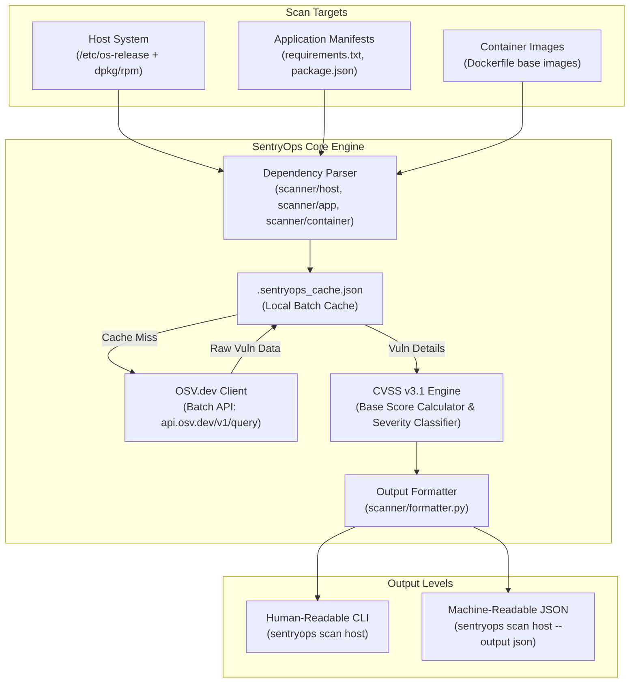

# SentryOps — Infrastructure & Application Vulnerability Scanner

**SentryOps** is a lightweight, agentless DevSecOps vulnerability scanner built in Python. It scans system packages, application manifests, and container base images, cross-references dependencies against the [OSV.dev API](https://osv.dev) in batch queries, calculates exact CVSS v3.1 base scores, and generates both **Human-Readable** CLI reports and **Machine-Readable JSON** artifacts.

---

## 🏛️ Architecture



---

## 🌐 The Three Scan Domains

SentryOps categorizes infrastructure into three distinct scan domains:

### 1. Host Domain (`sentryops scan host`)
- **System Detection**: Auto-parses `/etc/os-release` to detect OS name, version, architecture, and package manager (`dpkg` or `rpm`).
- **Ecosystem Mapping**: Maps distro family and release versions to OSV target ecosystems (e.g., `Debian:12`, `Debian:13`, `Ubuntu:24.04`).
- **Package Inventory**: Scans installed system packages via native package manager commands (`dpkg-query` or `rpm -qa`).

### 2. Application Domain (`sentryops scan app`)
- **Manifest Parsing**: Scans project workspace files for application dependency manifests:
  - `requirements.txt` (Python PyPI packages)
  - `package.json` / `package-lock.json` (Node.js NPM packages)
- **Pinned Version Resolution**: Extracts package names and exact installed version strings (`requests==2.31.0`).

### 3. Container Domain (`sentryops scan container`)
- **Dockerfile Inspection**: Parses `Dockerfile` manifests to identify base container images (e.g., `FROM ubuntu:24.04`, `FROM node:18-alpine`).
- **Image Vulnerability Checking**: Cross-references base image versions against known base distribution advisories.

---

## 📊 CVSS Scoring Approach & Severity Bucketing

SentryOps does **not** rely on naive string matching for severity classification. Instead, it extracts CVSS vector strings and calculates exact numerical base scores according to the official **FIRST.org CVSS v3.1 Specification**.

### CVSS Base Score Calculation

For CVSS v3.0 / v3.1 vectors (e.g., `CVSS:3.1/AV:N/AC:L/PR:N/UI:N/S:U/C:H/I:H/A:H`):

1. **Impact Sub-Score (ISS)**:
   $$\text{ISS} = 1 - ( (1 - C) \times (1 - I) \times (1 - A) )$$
2. **Impact Metric**:
   $$\text{Impact} = \begin{cases} 6.42 \times \text{ISS} & \text{if Scope (S) is Unchanged (U)} \\ 7.52 \times (\text{ISS} - 0.029) - 3.25 \times (\text{ISS} - 0.02)^{15} & \text{if Scope (S) is Changed (C)} \end{cases}$$
3. **Exploitability Sub-Score**:
   $$\text{Exploitability} = 8.22 \times AV \times AC \times PR \times UI$$
4. **Base Score Calculation**:
   $$\text{Base Score} = \min\left( \text{Impact} + \text{Exploitability}, 10.0 \right) \quad \text{(rounded up to 1 decimal place)}$$

### Severity Bucketing Matrix

| Severity Level | CVSS Base Score Range | Example Metric Vectors |
| :--- | :--- | :--- |
| **CRITICAL** | **9.0 – 10.0** | `AV:N/AC:L/PR:N/UI:N/S:U/C:H/I:H/A:H` (Score: 9.8) |
| **HIGH** | **7.0 – 8.9** | `AV:N/AC:L/PR:N/UI:N/S:U/C:H/I:N/A:N` (Score: 7.5) |
| **MEDIUM** | **4.0 – 6.9** | `AV:N/AC:H/PR:N/UI:R/S:U/C:H/I:N/A:N` (Score: 5.3) |
| **LOW** | **0.1 – 3.9** | `AV:L/AC:H/PR:L/UI:R/S:U/C:L/I:N/A:N` (Score: 2.5) |

---

## 📌 The Debian-Testing Fixed-Version Caveat

When running scans on rolling or pre-release testing Linux distributions (e.g., **Debian 13 Trixie**), findings may display:

```text
DEBIAN-CVE-2026-14266
Package:   7zip
Installed: 25.01+dfsg-1~deb13u2
Fixed:     None
Severity:  HIGH
```

### Why `Fixed: None` Appears
1. **Upstream Advisory Lifecycle**: In Debian testing/unstable tracks, security patches are staged in `unstable` (Sid) before migrating to `testing`.
2. **OSV Range Semantics**: The OSV database schema only emits a `{ "fixed": "<version>" }` event when a backported fix is explicitly tagged for that specific release branch (`Debian:13`). If a fix has not yet landed in the testing branch, the range remains un-closed, resulting in `Fixed: None`.
3. **Stable Distros & PyPI**: For PyPI, NPM, and stable Debian releases (e.g., `Debian:10`, `Debian:11`, `Debian:12`), exact fix version numbers (`Fixed: 2.32.4`, `Fixed: 2:9.2.0119-1`) are extracted and populated.

---

## 🚀 Quickstart & CLI Command Reference

### Target Command Matrix & Aliases

| Command | Target Aliases | What it Scans | Description |
| :--- | :--- | :--- | :--- |
| **`sentryops scan host`** | `host` | **Linux OS Packages** | Scans system packages via `dpkg` (Debian/Ubuntu) or `rpm` (RHEL/Fedora/CentOS). |
| **`sentryops scan app`** | `dependencies`, `application` | **Application Dependencies** | Scans application manifests (`requirements.txt`, `package.json`). |
| **`sentryops scan container`** | `docker` | **Container Images** | Scans base images specified in `Dockerfile` manifests. |
| **`sentryops scan all`** | `all` *(Default)* | **All 3 Domains** | Unified multi-domain scan across Host, Application, and Container targets. |

---

### Output Options & Formatting Flags

| Flag / Option | Short Flag | Values / Syntax | Description |
| :--- | :--- | :--- | :--- |
| **`--output`** | **`-o`** | `text` *(default)* | Renders human-readable terminal report with summary counts and findings. |
| **`--output`** | **`-o`** | `json` | Outputs formatted machine-readable JSON to stdout. |
| **`--output`** | **`-o`** | `<filepath.json>` | Saves structured JSON report to specified file path (e.g. `-o report.json`). |
| **`--format`** | **`-f`** | `text` \| `json` | Explicitly sets the output format rendering. |

---

### Example Commands

```bash
# 1. Scan Linux system packages (Human-Readable CLI)
sentryops scan host

# 2. Scan Application dependencies (using 'dependencies' or 'app' alias)
sentryops scan dependencies
sentryops scan app

# 3. Output Machine-Readable JSON to stdout
sentryops scan app --output json

# 4. Save JSON report to file while displaying terminal summary
sentryops scan all --output report.json

# 5. Explicit format option
sentryops scan host --format json
```

---

### Terminal Report Example

```text
SentryOps Security Scanner
───────────────────────────

Target:   application
Type:     Application Dependencies
OS:       Debian GNU/Linux 13
Manager:  dpkg

Packages scanned: 1

Vulnerabilities
───────────────────────────

CRITICAL  0
HIGH      0
MEDIUM    3
LOW       0

CRITICAL & HIGH FINDINGS
...
───────────────────────────
Scan completed in 0.1s (cached)
```

### Machine-Readable JSON Report Example

```json
{
  "scan": {
    "id": "scan-20260814-001",
    "started_at": "2026-08-14T15:40:09Z",
    "duration": 0.1,
    "target": "application",
    "type": "app"
  },
  "summary": {
    "packages": 1,
    "vulnerabilities": 3,
    "critical": 0,
    "high": 0,
    "medium": 3,
    "low": 0
  },
  "findings": [
    {
      "cve_id": "GHSA-9hjg-9r4m-mvj7",
      "package": "requests",
      "installed": "2.31.0",
      "fixed": "2.32.4",
      "severity": "MEDIUM",
      "ecosystem": "PyPI",
      "match_reason": "Installed 2.31.0 < fixed 2.32.4 in PyPI"
    }
  ]
}
```

---

## ⚠️ Known Limitations

- **Package Managers**: Currently supports **`dpkg`** (Debian, Ubuntu, Mint, Kali) and **`rpm`** (RHEL, Fedora, CentOS, Rocky, AlmaLinux, Amazon Linux). Does not currently support `pacman` (Arch Linux) or `apk` (Alpine Linux).
- **Single-Distro Host Scope**: Host scans evaluate the primary operating system distribution installed on the target machine.
- **Offline & Rate-Limit Caching**: Queries OSV.dev in 1000-package batches via HTTP POST API; sub-second repeat scans rely on the local cache file (`.sentryops_cache.json`).

---

## 📄 License

MIT License. See [LICENSE](LICENSE) for details.
